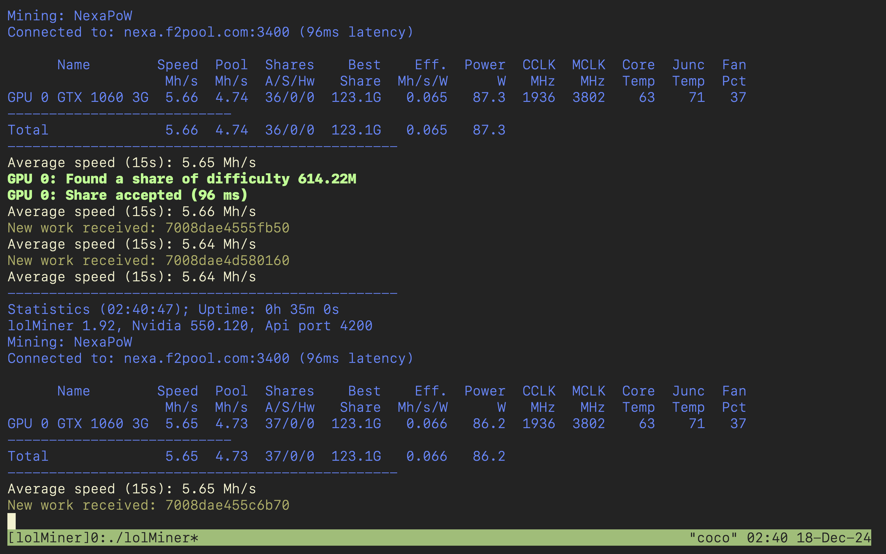
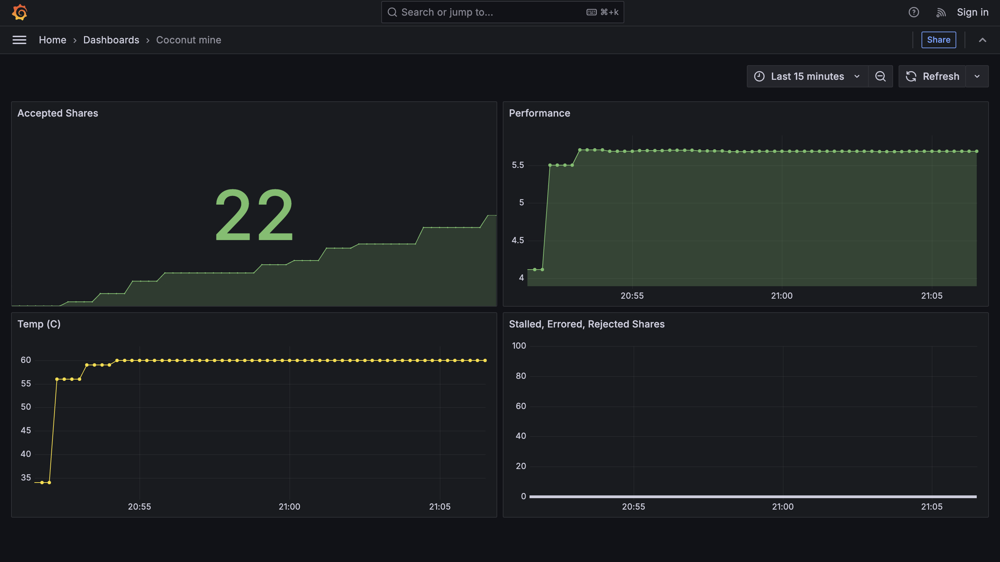

+++
authors = ["Arman Drismir"]
title = "Using an old PC to mine crypto 😳 😬"
description = "I use an old pc to mine crypto and hook the whole thing up to a  prometheus/grafana setup."
date = 2024-12-05
[taxonomies]
tags = ["Crypto", "Grafana", "Prometheus"]
+++

The PC I am using to run this webserver also happens to have a NVIDIA GTX 1060. I may as well see if I can mine crypto with it. My poor 1060 is not strong enough mine blocks, even on smaller coins, so I needed to find a mining pool for a coin that would not overwhelm my 3GB of VRAM. I found NEXA on f2pool which works perfectly!

Using [lolMiner](https://github.com/Lolliedieb/lolMiner-releases) and an [f2pool](https://www.f2pool.com/) account I can start mining!

I cannot hope to make actual money from mining NEXA with a 1060 but I can hope to setup some nice analytics with prometheus and grafana.

I am using lolMiner to mine NEXA which exposes a nice api for us. After some finagling with prometheus and grafana I was able to get some cool insights!

So I was a able to get 22 shares of the block in 15 minutes. If I leave it running for a whole day I can expect about 6500 NEXA. **This equates to $0.007 USD a day.** 

At this rate if I mined NEXA coin for 391 389 years then I would be have a million US dollars! 🥳

<!-- You can check out the [live analytics](https://coconut-mine.drismir.ca/d/de78xri7hrugwf/coconut-mine?orgId=1&from=now-6h&to=now&timezone=browser) but it will likely be idle since mining NEXA coin makes my webserver unstable 😬 -->
