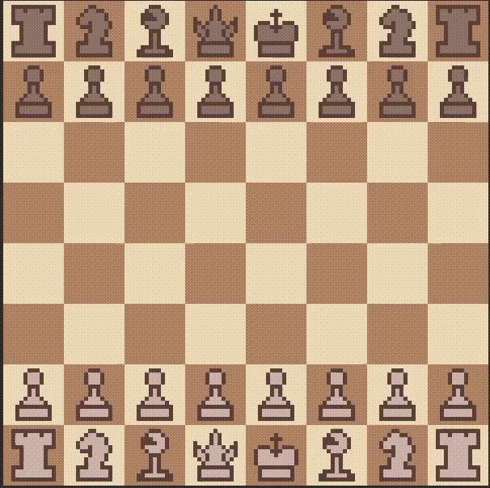
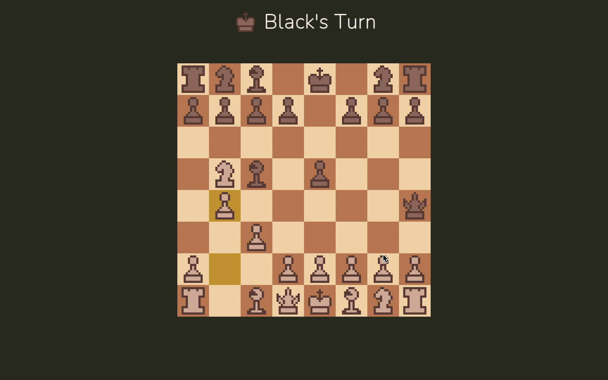

+++
authors = ["Arman Drismir"]
title = "C++ Chess Engine"
description = "Chess algorithms I built for the C++ Chess game I made"
date = 2023-07-30
[taxonomies]
tags = ["C++", "SFML", "CMake", "Algorithm Design"]
[extra]
hot = true
toc = true
toc_sidebar = true
+++

### Developing the base game:

I spent the first month of this project developing a chess game with C++. 
This was my first serious programming project, I learned a lot about software 
development in the month I took to build the base game.  

At the end of the month I had a finished Chess Game with nice features like 
markers on the board to show you the valid moves a held piece can make. Generating 
this list of valid moves would become the biggest challenge when designing 
my chess engines.

Now it was time to start developing my chess engines. After a small amount of 
work mapping out my engine logic I realized my original design had some obvious 
flaws.  

I just finished an algorithms class in C++ so I had made the board state 
an array of pointers, where an index would point to a piece object, 
a null pointer meant the square was empty. There is no reason to 
use pointers here since no two squares should even point to the same piece. Even 
if a chess board had a use case for pointers it still would not be worth it 
since it adds so much unnecessary complexity. Simple things like captures, 
castling and en-passant were nightmares when everything was a pointer.

My first step was therefore refactoring the entire `Board` class for about 
10 hours straight. It was worth it because at the end it was massively simplified, 
no more useless pointers.

### Simple chess bot: _Drunk Engine_

The first engine I created with my new `Board` interface was the _Drunk Engine_.
This engine priorities moves in this order:

<ol type="i">
  <li>Check enemy king</li>
  <li>Take undefended enemy piece</li>
  <li>Take defended enemy piece</li>
  <li>Castle</li>
  <li>Random move</li>
</ol>

This is a clip of _Drunk Engine (Black)_ finding the mate in one against me. I 
manually setup the board for black then I click the spacebar to get _Drunk Engine_ 
to make a move, it found the checkmate :)

Unfortunately, drunk engine is not actually very good. It loves to lose pieces just 
to check the enemy king. Below is a video of _Drunk Engine (Black)_ playing against 
_Random Engine (White)_. (_Random Engine_ just makes random moves).

<video controls muted playsinline>
  <source src="DrunkVRand.mp4" type="video/mp4">
  Your browser does not support the video tag.
</video>

### Simple chess bot: _Hippie Engine_

Before I implement a truly formidable engine, I wanted to see how far I could take the 
"greedy" engines that move based on heuristics and the legal moves at their disposal.

To do this I created two more engines. The first being the _Hippie Engine_. It 
priorities moves in this order:

<ol type="i">
  <li>Checkmate enemy</li>
  <li>Take undefended piece</li>
  <li>Support an undefended ally piece</li>
  <li>Move a piece out of danger</li>
  <li>Castle</li>
  <li>Check the enemy king</li>
  <li>Random move</li>
</ol>

_Hippie Engine (Black)_ is able to destroy _Random Engine (White)_ with its more careful playstyle.

<video controls mute playsinline>
  <source src="HippieVRand.mp4" type="video/mp4">
  Your browser does not support the video tag.
</video>

### Simple chess bot: _Bot Feaster_

The last greedy engine is called _Bot Feaster_. It is meant to be a solid greedy chess algorithm.
Its move priority is:

<ol type="i">
  <li>Checkmate enemy</li>
  <li>Take hanging piece</li>
  <li>Make positive trade</li>
  <li>Move pieces being attacked by a lower value piece away</li>
  <li>Defend pieces being attacked by an equal or higher value piece</li>
  <li>Castle</li>
  <li>Make an equal trade</li>
  <li>Random move</li>
</ol>

The ability to make positive piece trades makes _Bot Feaster_ much stronger than 
any of the engines before it. Below is a video of _Bot Feaster (White)_ 
against _Hippie Engine (Black)_, where _Bot Feaster_ wins easily and quickly.

<video controls mute playsinline>
  <source src="BotFeastVHippie.mp4" type="video/mp4">
  Your browser does not support the video tag.
</video>

### The first serious chess bot using the Mini Max algorithm

I decided to build the classic Mini Max engine. With Mini Max you simulate every 
possible sequence of moves up to a depth 'x'. You then search the tree to find 
which moves result in the best position 'x' turns in the future. While 
searching for board states, we always assume that the enemy will also make the 
move that results in the best board state for themselves. That way even if the 
enemy plays optimally we can still expect to reach the best state for ourselves. 

The reason this strategy is not perfect is because it is always possible that if 
we only looked one move deeper we would see that a move really is not so advantageous 
after all. Additionally judging what board state is 
good/bad is difficult and not an exact science. For this project I am scoring the 
advantage of a board using only piece material value. More sophisticated 
algorithms take into account all sorts of other ways a position is valuable.

Upon creating a very simple function to search the board, I found out my `getMoves` 
function was excruciatingly slow. It was taking me 75 seconds to search 4 ply's deep. 
For reference, [Sebastian Lague did it in 0.052 seconds](https://youtu.be/U4ogK0MIzqk?si=uRoJWJC7ansb_CFE&t=710).

After some profiling I found out that pretty much all of my time was spent on the 
`getMoves` function. Before I went any further I needed to make `getMoves` faster 
by many orders of magnitude.

After stepping through my `getMoves` function I got the idea that maybe passing by value 
throughout all my helper functions is causing slowdown. I changed my functions to pass 
by reference and got an astounding **12x** speed up.  

Passing by value:
~~~
3 ply's in 3.5978 seconds
4 ply's in 75.8671 seconds
5 ply's in 1934.85 seconds
~~~

Passing by reference:
~~~
3 ply's in 0.286129 seconds
4 ply's in 5.99357 seconds
5 ply's in 139.311 seconds
~~~

This was the only easy speedup I could achieve though. My next step was redesigning 
my `getMoves` function from the ground up. My first approach was to create a 
function `legalMove` that returns true/false. I would then loop through each piece 
on the board and then loop through each square for every piece to check if the piece 
could move there. This is actually an elegant solution that lets you `getMoves` very 
simply. For performance it is awful. Funnily enough though, since the board's size is 
a constant, get moves is exactly O(board_size^4)=O(64^4)=O(1). So our 
QUADRUPLE nested for loop is technically O(1).

`getMoves` needs to be done at every node of our tree, and our tree grows 
exponentially so improving its performance should give exponentially better results. 
The next optimizing step was to instead only check if our pieces can move to 
specific squares. Ie. only check if bishops can move to squares diagonal to them, if
rook's can move to squares parallel and adjacent to them, etc... This reduces our 
number of operations per `getMoves` call from 16777216 to roughly 4096, a x4096 decrease.

New `getMoves` function:
~~~
3 ply's in 0.159027 seconds
4 ply's in 3.57797 seconds
5 ply's in 87.5583 seconds
~~~

These results are welcome but disappointing. It is only 1.7 times faster and I remade 
the internal logic of most of my board class. The good thing about this redesign is 
I now have a lot more ideas for improvement.

An important function is `colorHasMoves` function, where we check if the player has 
valid moves. This is needed to check for checkmate. Before I would simply call 
`getMoves` and then check if any moves were returned. This is inefficient though 
since we don't care if the player can make 1000 or 1 move. Ideally we would return 
after finding the first move.

Additionally we call `colorHasMoves` after every move since we need it to check if 
there has been a checkmate. But do we need to do this? We actually do not and explicitly 
checking for game over after each move is a mistake for the Mini Max algorithm.

In this code we call getMoves at the start.
We also call getMoves under the hood every 
time we call makeMove. So we end up calling 
getMoves for each of this nodes children.
Then our children nodes will do the 
same. So we end up calling getMoves for each 
node twice. Each layer this wastes exponentially 
more time.

~~~c++
std::vector<move> legal_moves = getMoves();

for (auto move in legal_moves) {
  makeMove(move);
  // evaluate move
  undoMove(move);
}
~~~

If we stop implicitly checking for game over after each move then 
we can structure our Mini Max algorithm like this. The code below 
only needs to call `getMoves` once for each node.

~~~c++
std::vector<move> legal_moves = getMoves();

if (legal_moves.size() == 0) {
  return -1000000;
}

for (auto move in legal_moves) {
  makeMove(move);
  // evaluate move
  undoMove(move);
}
~~~

This insight gives us a wonderful performance upgrade:
~~~
1ply   in 0.000727 seconds
2ply's in 0.000731 seconds
3ply's in 0.006936 seconds
4ply's in 0.078796 seconds
5ply's in 3.21982 seconds
~~~

I was happy with Mini Max's performance so I stopped there, although there are many more interesting 
optimizations to make. If we set minimax's search depth to two it is can move instantly as far as 
humans can perceive. It can also destroy any of the greedy engines. In all of my testing I have never 
seen a close game between mini max and one of my simple chess bots, it is even challenging for me to play 
against.  

Mini Max vs Random Engine:
<video controls mute playsinline>
  <source src="MiniVsRand.mp4" type="video/mp4">
  Your browser does not support the video tag.
</video>

### Conclusion

Working on this project made me feel like a programmer for the first time. I gladly 
programmed all day to push this project toward the finish line. Building a project like this 
over the course of a month opened my eyes to the world of version control, libraries and 
documentation. I had heard of all three before but I never really understood why people used them.
A big reason this made me feel like a real programmer was because I was constantly interacting with by 
own past design decisions. The utility of abstractions and classes was hard for me to accept. 
As a project grows large enough abstractions become necessary and obvious, when I made that 
realization I could understand why code I was reding across the board was designed the way it was.

Designing a chess engine is an amazing experience. Even a year later I still get the urge 
to come back and test out potential improvements.

