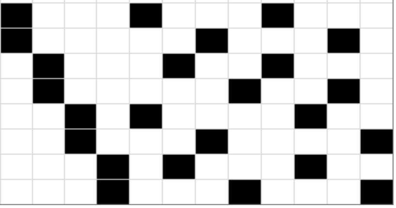
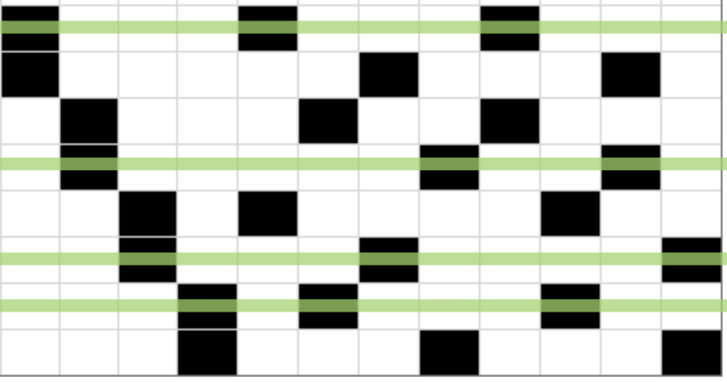
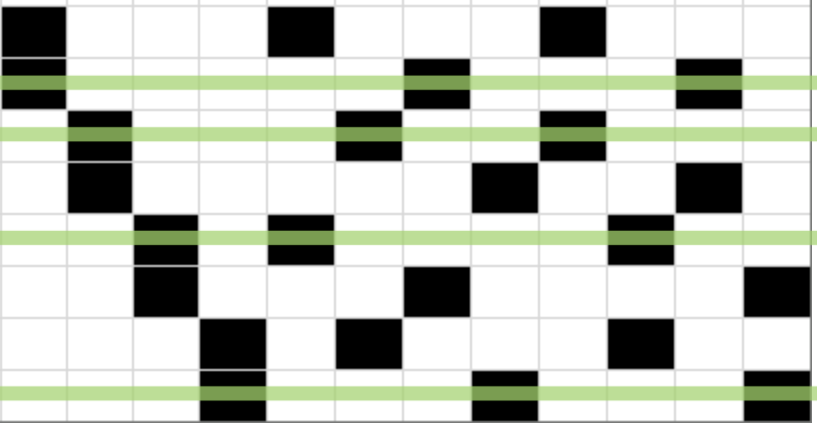
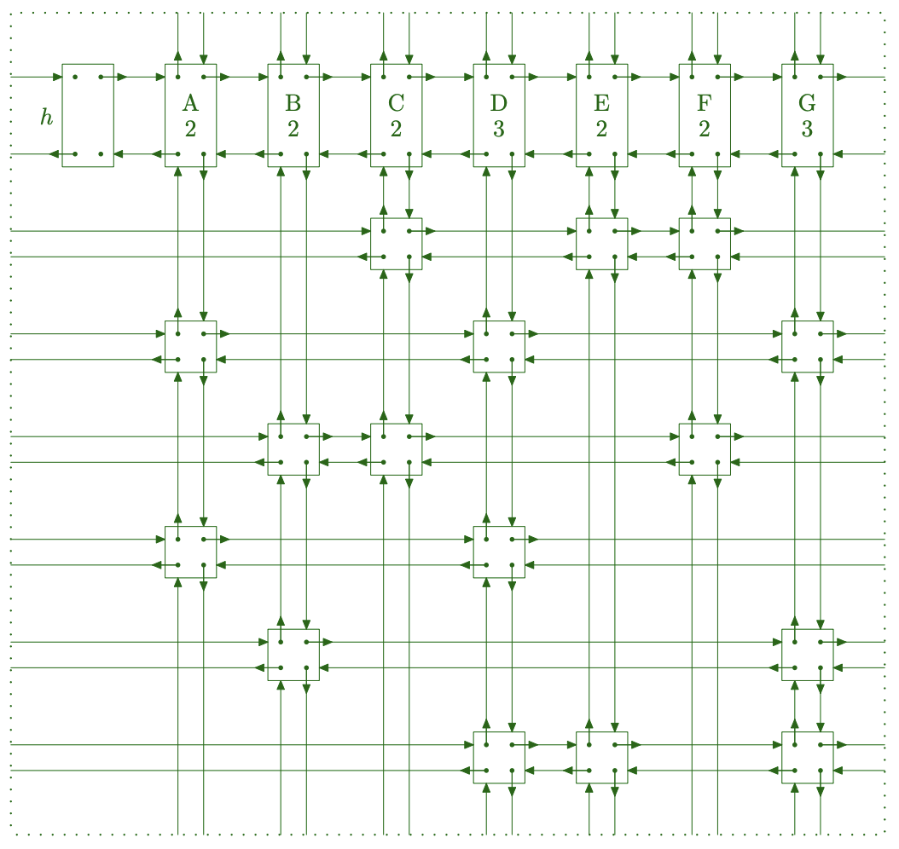

+++
authors = ["Arman Drismir"]
title = "Super Efficient Sudoku Generation"
description = "Using the Dancing Links algorithm to generate sudoku boards"
date = 2026-07-07
[taxonomies]
tags = ["Algorithm Design", "Dancing Links", "Rust", "Sudoku"]
[extra]
hot=true
+++

While creating my very first web app, a Sudoku game: (<a href="https://sudoku.drismir.ca/" target="_blank">https://sudoku.drismir.ca/</a>).
I hacked together a backtracking algorithm to generate the boards. For Sudoku, 
backtracking felt very brute-force-y so I promised I would find a more efficient
way.

It turns out there is pretty much only one option for quicker board generation
and that is the dancing links algorithm by Donald Knuth from the year 2000! 
<a href="https://arxiv.org/pdf/cs/0011047" target="_blank">He wrote a paper on it</a>,
but honestly the paper was so abstract I could not 
make much of it. The resource that carried me through the project was
<a href="Zendoku-puzzle-generation.pdf" target="_blank">this writeup</a>
on how the 2007 Nintendo DS game Zedoku implemented dancing links.
(The original website for the writeup has been lost to time so I had to use the
wayback machine to access it 😬)

## The Reduction Part of the Algorithm

Dancing links does not solve Sudoku specifically, instead it solves an exact 
cover problem. That is, given a list of rows, find a selection of rows that have
only one cell in every column.

For example, in the exact cover problem below, there are two selections that
solve the problem.

  

    
Solution 1

    
  

  

    
Solution 2

    
  

Therefore, to get dancing links to solve a sudoku board we must first devise a
reduction algorithm that will convert the constraints of a sudoku board into an
exact cover problem. For details on how to do this check out the zendoku 
writeup above, it is a very good resource.

The TLDR; for the reduction is that we have a 729x324 table, where every row
represents a single number being assigned into a single cell (Ie. row 0
represents placing a 1 into the top left cell). Every column represents a 
constraint (ie. row 1 must have a 5 in it).

We feed this 729x324 table into our implementation of the dancing links
algorithm and it will return a list of rows where each constraint is satisfied
exactly one. This means by definition that it is a valid sudoku board.

Once dancing links returns the list of rows, we are not finished yet, we need to
convert each row back into its respective number assignment on the sudoku board.

## The Dancing Links part of the Algorithm

The reduction is only half the battle of the algorithm. If you used only the
above insights you would actually be implementing algorithm x, not dancing links.
And for sudoku, you end up spending so
much time searching through your massive 729x324 table, that it ends up being
slower than the obvious backtracking algorithm.

I would know, because that is exactly what I did, and this was the result I got:

<table>
  <thead>
    <tr style="text-align: left;">
      <th>Algorithm</th>
      <th>Time per Board</th>
    </tr>
  </thead>
  <tbody>
    <tr>
      <td>Depth First Search</td>
      <td>0.374 ms</td>
    </tr>
    <tr>
      <td>Algorithm X</td>
      <td>253 ms</td>
    </tr>
  </tbody>
</table>

To finally make this a dancing links implementation you must represent the table
with a doubly linked list, with column headers tracking the number of cells below.
Note the pointers wrap around the edges of the board.

If you look at the 
<a href="https://web.archive.org/web/20230426084731/https://garethrees.org/2007/06/10/zendoku-generation/#section-4.2" target="_blank">
  cycle of four operations taken by dancing links
</a> 
you will be able to put together how we can use these pointers to completely
avoid searching the table for populated cells.

As a single example on how dancing links optimizes our search for rows. In step
2 where we need to find a row that satisfies our selected column, dancing links allows
us to instantly find the next available row instead of needing to check every index
in that row. (<a href="https://github.com/ArmanDris/dancing_links_sudoku/blob/bc571c155f4069a0022cd3feb6efb340a2e175e0/src/dancing_links.rs#L346-L375" target="_blank">Link to source code for selecting row</a>)

It would be impossible to enumerate all the fiddly details of implementing dancing links
(which is probably why knuth and the Zendoku writeup avoid doing it as well). If
you would like to implement this algorithm for yourself, work through some simple examples
to understand the ideas behind the reduction, then run through the algorithm by hand
to understand the huge time save dancing links gives.

## How Fast is it?

Thankfully, after implementing dancing links I was able to beat backtracking
(unlike my algorithm x implementation which was an epic fail).

Here is the performance of all three:

<table>
  <thead>
    <tr style="text-align: left;">
      <th>Algorithm</th>
      <th>Time per Board</th>
    </tr>
  </thead>
  <tbody>
    <tr>
      <td>Dancing Links</td>
      <td>0.107 ms</td>
    </tr>
    <tr>
      <td>Depth First Search</td>
      <td>0.374 ms</td>
    </tr>
    <tr>
      <td>Algorithm X</td>
      <td>253 ms</td>
    </tr>
  </tbody>
</table>

I also wanted to get a feel for what my algorithm was really doing, so I created a visualization of
the 729x324 table and the links as they traverse toward a solution. Check this out:

<iframe height="600" src="https://www.youtube.com/embed/dGBS9GXpn_w?si=1k_-4hHORyH8d-ee" title="YouTube video player" frameborder="0" allow="accelerometer; autoplay; clipboard-write; encrypted-media; gyroscope; picture-in-picture; web-share" referrerpolicy="strict-origin-when-cross-origin" allowfullscreen></iframe>

Source code for this project is here: <a href="https://github.com/ArmanDris/dancing_links_sudoku" target="_blank">https://github.com/ArmanDris/dancing_links_sudoku</a>
