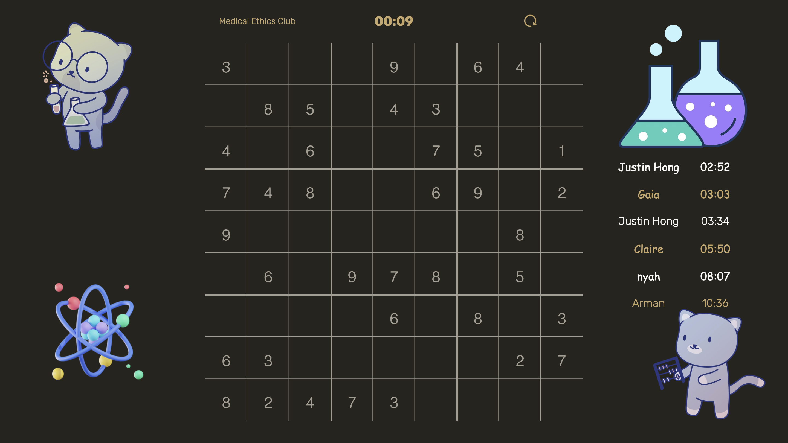
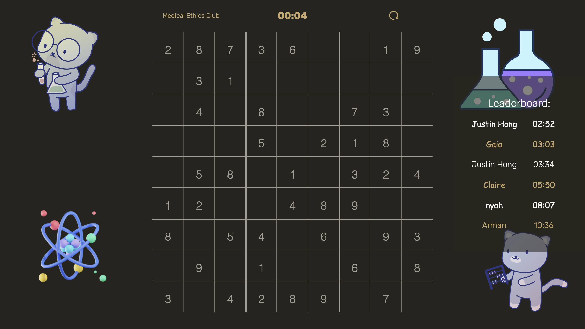
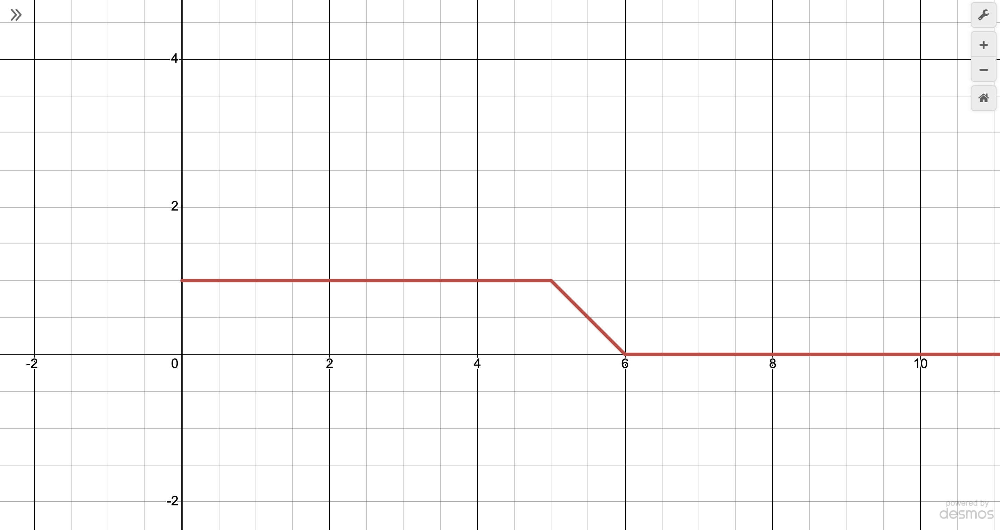

+++
authors = ["Arman Drismir"]
title = "Medical Ethics Sudoku Incident Report"
description = "The med ethics sudoku site had a catastrophic UI malfunction "
date = 2024-12-05
[taxonomies]
tags = ["CSS"]
[extra]
toc = true
toc_sidebar = true
+++

### The malfunction

On december 6th the [UBC Medical Ethics](https://med-ethics.drismir.ca) club website had a 
catastrophic UI failure.



As you can see the the leaderboard header is obscured by the beaker png. The leaderboard header and 
beaker png are both performance critical, I needed to quickly resolve this conflict before 
our malfunctioning UI caused undue stress for our users.  

### The solution
Fortunately me and @ny4h1c were able to engineer an elegant and maintainable solution.



As you can see we managed to keep both the leaderboard header and beaker png online with 
minimal disruption to our loyal users. This was achieved with the following CSS rules:

```css
#greeting {
    z-index: 20;
    /* ... */
}

#beaker-img {
    /* ... */
    z-index: 1;
}

#leaderboard {
    /* ... */
    background: #27241d91;
    z-index: 5;
}

```

### Investigation

After a thorough investigation with our site reliability team we discovered that the error occured because more users completed the mini game than we anticipated. 
As shown by the graph if more than five users submit a leaderboard time the system is completely overwhelmed and the visibility of the leaderboard header drops to zero.


