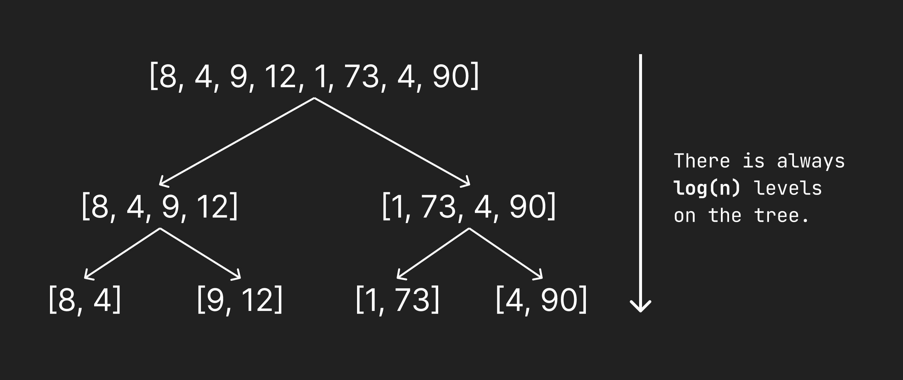
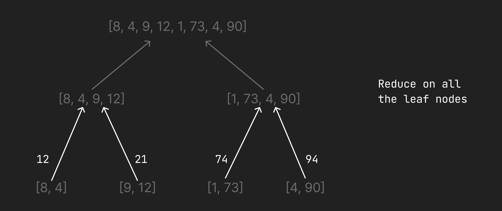
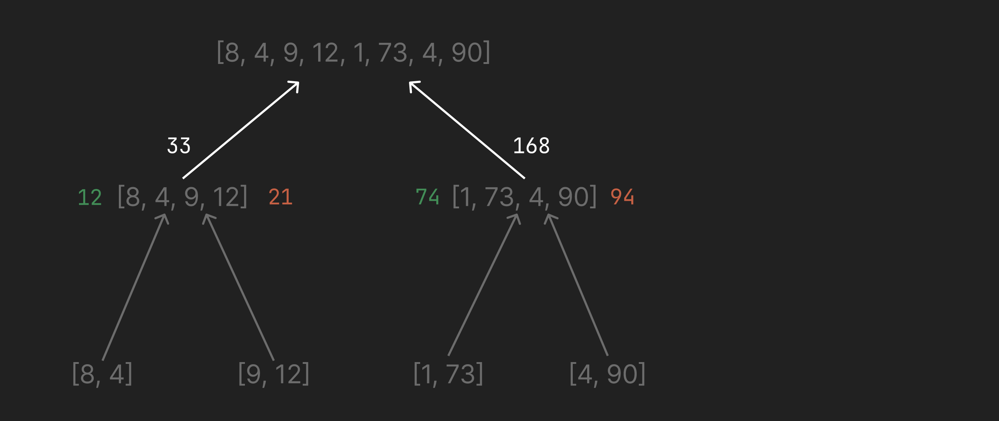
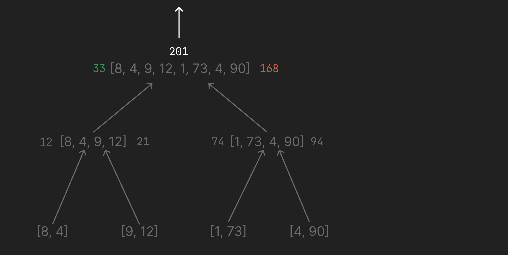
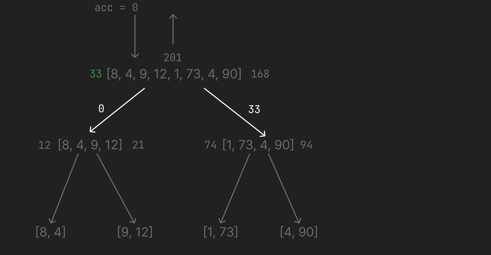
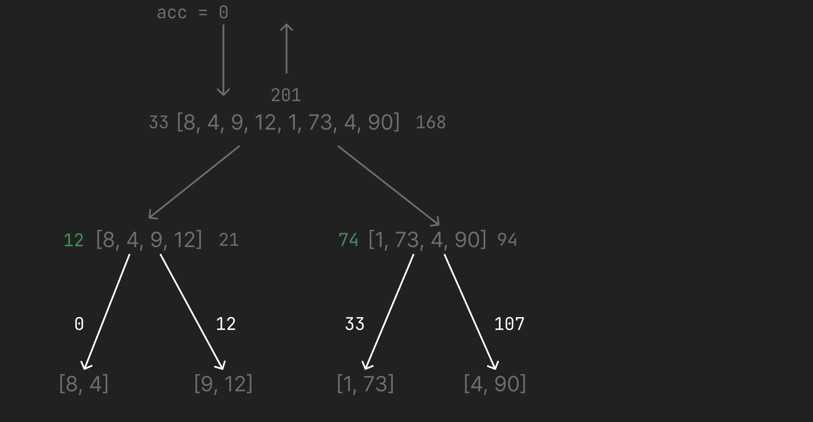
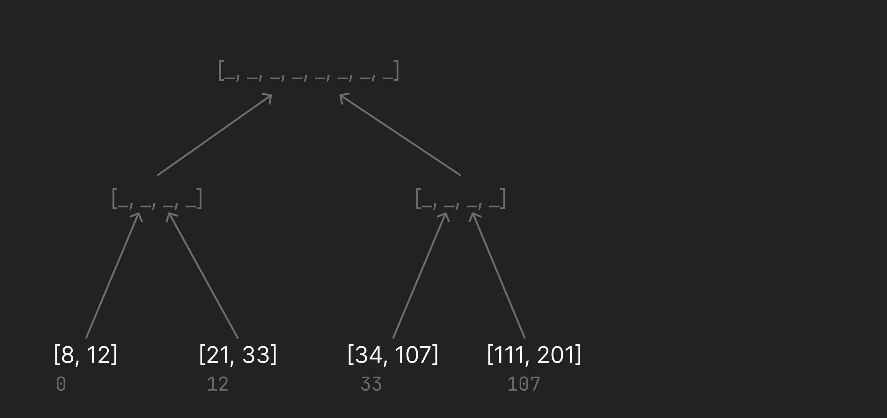
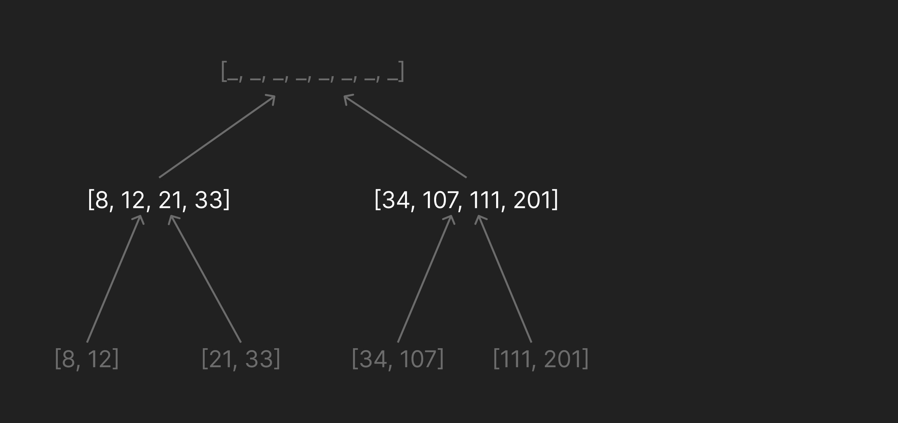
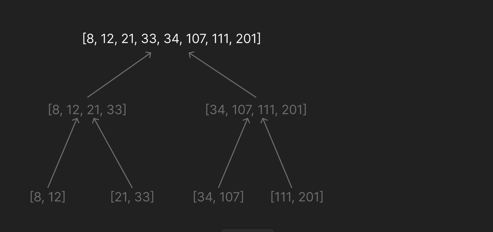

+++
authors = ["Arman Drismir"]
title = "Parallelizing the Scan function with Gleam!"
description = "By breaking the problem into a tree, we can scan in O(log n)"
date = 2026-07-06
[taxonomies]
tags = ["Gleam", "Erlang", "Parallel Computing"]
[extra]
+++

## Scan Overview

Scan computes the running total of a list. Eg. for the list `[2, 1, 10, 3]`, the
running total would be `[0, 2, 3, 13]`. On first glance it is not at all obvious
how this can be done in parallel. For example if we wanted to compute just the
last two indexes in their own thread to save time: `[10, 3]`, we would be stuck
because we need to know the sum of everything that came before to return the
result. Of course waiting for the sum of everything that came before ruins the
benefit of multithreading in the first place.


The key to parellizing this is with a clever trick. Note that the `fold` or
`reduce` function is easily parallelizable. If we want to calculate the `reduce`
of `[1, 2, 3, ..., 100]` we can just spawn 5 threads, give each thread 20 elements
and boom we can compute it in `log(n)` time.


The clever trick for parallelizing scan is to first run a `reduce` on the list in
`log(n)` time. As we reduce we will pass around the sum of each list segment in
such a way that all segments will receive their sum of previous elements in at
worst `log(n)` time. We can then run the scan parallelly in `log(n)` time, resulting
in a total runtime of `2 log(n) + λ` (where λ is the cost of sending data across threads).


## Visualization of process tree

For an understanding of exactly how we need to pass around the data to achieve this runtime
look at this visualization for scanning the list `[8, 4, 9, 12, 1, 73, 4, 90]`:


Step #1: Spawn a tree of processes


Step #2: Run reduce on the leaf nodes, and send result to parent node


Step #3: In each parent node, store results of children, then sum them and send to parent


Step #4: Repeat for root node. Store results of children then sum them. Because this is the root node,
instead of sending the sum up, we will begin the downward pass.


Step #5: Once the top of the tree has been reached, the root node gives its right child
the sum of the left half of the tree.


Step #6: Now each intermediate node has all the information required to give its
children the sum of everything to the left.


Step #7: Each leaf node uses its sum to calculate its portion of the scan.


Step #8: The results of each child's scan is bubbled up the tree and the parent node
combines the results.


Step #9: The root combines the two halves of the scan results, and we are left
with the final result!



## Implementation in Gleam


(For the full code <a href="https://github.com/ArmanDris/star_scan">check out the repo</a>)


## Results

Using an expensive combination function we can add up 500 elements faster than sequential!

```gleam
star_scan % gleam run
Sequential scan done in 5501 ms
Parallel scan done in 1007 ms
```

Note however, this was using this artificially expensive addition function:
```gleam
let expensive_combine_fn = fn(a, b) {
  process.sleep(10)
  int.add(a, b)
}
```

What happens if we use the regular addition function?

```gleam
star_scan % gleam run
Sequential scan done in 0 ms
Parallel scan done in 7 ms
```

Our parallel function gets destroyed X_X. This is an important limitation of
this parallel implementation. We incur a lot of overhead constructing the tree
and passing values around. This will only ever save time in cases where the
combine function is very expensive.

When the combine function is expensive however, this function can give some very
nice runtimes :)
