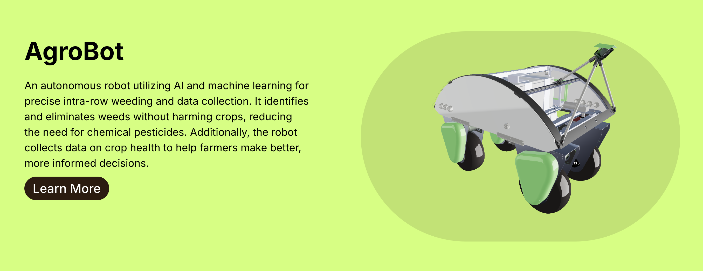
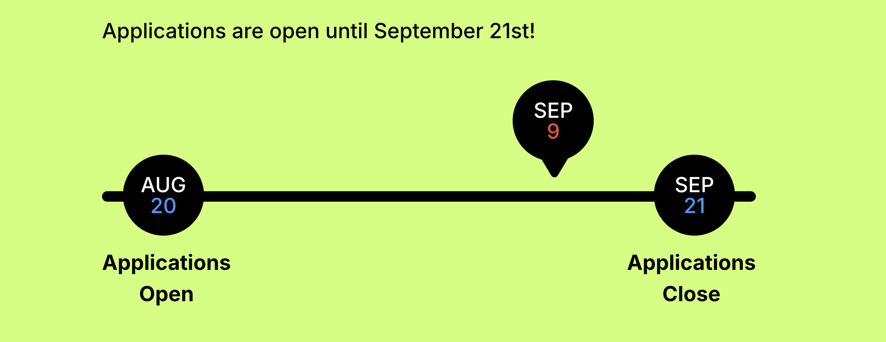

+++
authors = ["Arman Drismir"]
title = "AgroBot Website"
description = ""
date = 2024-08-22
[taxonomies]
tags = ["React", "TailwindCSS", "JavaScript"]
[extra]
+++

After eight busy months the WebDev team finally finished the UBC AgroBot website!
[ubcagrobot.com](https://ubcagrobot.com)

The coolest part of the website is the 3d models of the robots we are buildings. You can even drag them around!

My favorite component is the recruitment timeline I made. I learned about some awful JavaScript Date related properties while making this.

We still need to come up with an actual hosting solution and we need to develop something the marketing team can use to publish new articles. Overall I am very happy with how the website turned out, it feels good to finally publish 😮‍💨.