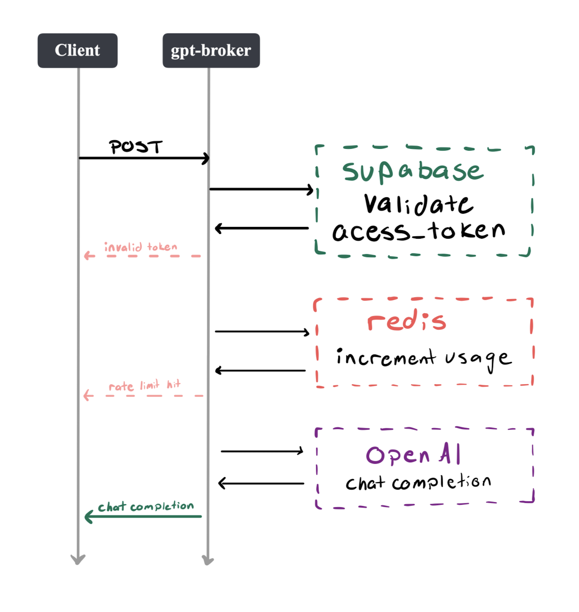

+++
authors = ["Arman Drismir"]
title = "gpt-broker"
description = "Secures all OpenAI API requests for SkillSync"
date = 2024-08-31
[taxonomies]
tags = ["Koa", "Redis", "JavaScript", "Docker", "Microservice"]
[extra]
hot = true
+++

SkillSync uses a lot of OpenAI API chat completions. We needed to:
- Keep API keys out of client side code
- Secure our ChatGPT endpoints to prevent someone from running up our bill maliciously 😵

To keep development with OpenAI as frictionless as possible I developed gpt-broker. The idea is that gpt-broker takes an access_token and a prompt and handles everything else under the hood. 

### How it works:
A call to gpt-broker's API looks like this:
~~~
POST /advanced-gpt-4o-mini-complete
Authorization: Bearer <access_token>
[
    { role: 'system', content: "Write me a poem" },
    ...
]
~~~

gpt-broker processes the quest like this:


### Why use Redis?
It might seem weird that we use Redis to track usage since Supabase is a database and we need to validate the access token with them anyway. At first I did use supabase to track usage but I found out I was wasting a lot of time waiting for the request to move to/from supabase. With Redis we can run the cache locally and have almost no latency.

Here is a breakdown of the time taken for a request with supabase
```
Validate User:    174ms
Check Rate Limit: 234ms (update Supabase DB)
GPT:              677ms
---------------------------
Total:            1085ms
```

And this is with a local Redis cache:
```
ValidateUser:   174ms
CheckRateLimit: 4ms     (update local Redis cache)
GPT:            677ms
-------------------------
Total:          855ms
```

We save 230ms! Which is small for a human but still noticeable.