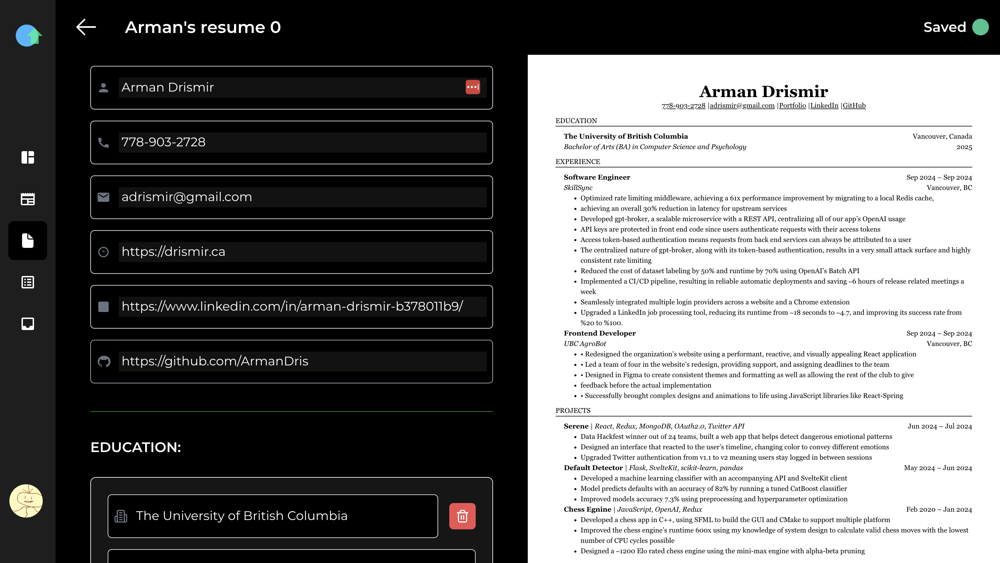

+++
authors = ["Arman Drismir"]
title = "Resume Builder"
description = "Lets you quickly build a Jake's Template resume with some convenient GPT Wrappers as well"
date = 2024-09-01
[taxonomies]
tags = ["React", "JavaScript", "TypeScript", "Supabase"]
[extra]
+++

I designed a resume builder so that our users can easily create resumes using Jake's Template. It also comes with some options to generate sections of your Resume with Chat GPT. Generating highlights using the Chat GPT wrapper makes resume building super fast. 

Pretty much all of development revolved around the Resume type definition:
~~~
export interface Resume {
    resume_id: string;
    label: string; // Shown to the user to identify resume
    full_name: string;
    phone_number: string;
    email: string;
    personal_website: string;
    linkedin: string;
    github: string;
    education: EducationSection[];
    experience: ExperienceSection[];
    projects: ProjectsSection[];
    technical_skills: SkillsSection[];
}
~~~

## Wrestling with State Updates:

Each of these attributes are their own state in the resume builder, so to update an attribute of any index in `EducationSection[]` we need to create a new section with the updates value and also a new array with the updated index. If we take for example, updating a single highlight within an project section, the code looks like this:
~~~
onChange={(e) => {
    let new_highlights: string[] = [...prj.highlights];
    new_highlights[hi_index] = e.target.value;
    const new_prj: ProjectsSection = { ...prj, highlights: new_highlights, };
    const new_prjs: ProjectsSection[] = [...projects];
    new_prjs[index] = new_prj;
    setProjects(new_prjs);
}}
~~~
This logic cannot be trivially put inside a helper function for all the sections to use since TypeScript complains that since the sections have different fields its illegal to allow the helper function to operate on the setter function. Getting around this would require a typescript type hack or adding inheritance in my data types.

I decided that the added complexity and separation of related code would do more harm than good and stuck with the simple solution.

## Syncing the Resume:

With a clearly defined type for each resume, syncing to Supabase is very easy. I just made a table with each property and then I can directly upload my Resume variables to Supabase. Since each property has its own state we can also auto save on every chance win a single `useEffect`. Since I thought naming conflicts would be a nightmare to deal with, especially if I risk overwriting another Resume, I added a uuid for each resume. I did not know that it was acceptable to create uuid's without checking that no other matching ones exist. It is a very nice system though since it makes creating resumes while offline possible.

## Overall:

I am very happy I decided to clearly define my data first, then build my components around my data. The type definitions I came up with made the overall structure very simple and the details harder. Which is much better than the other way around.